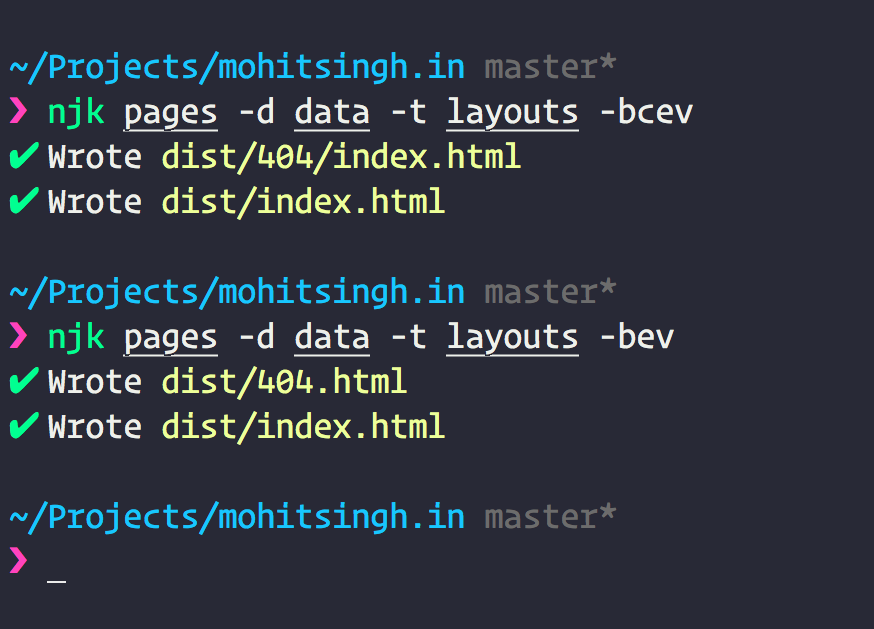

# njk

> Cli tool to render nunjucks templates with markdown and front-matter.

[](https://travis-ci.org/mohitsinghs/njk)
[](http://badge.fury.io/js/njk)
[](https://standardjs.com)
[](https://github.com/mohitsinghs/njk/blob/master/LICENSE)

## Install

Install with [npm](https://npm.im/njk)

```console
npm i -g njk
```

## Uses



```console
$ njk --help

  CLI tool to compile nunjucks with markdown and front-matter

  Usage
    njk <dirs|files|globs>

  Options
    --data, -d                JSON data
    --template, -t            Template directory
    --use-block, -b           Content block in files
    --escape-markdown, -e     Escape markdown
    --minify, -m              Minify output html
    --watch, -w               Watch file changes
    --clean, -c.              Use clean urls
    --out, -o                 Output directory
    --verbose, -v             Show verbose

    If no option is passed, current directory is used

  Examples
    njk page.njk -d data.json -t templates
    njk pages -d data -t templates
```

### Notes
Following options can be configured through front-matter of individual files.
 - __`useBlock`__ Wraps a content block around a page. If enabled, an empty content block is required in parent template where content will be inserted.
 - __`clean`__ Uses clean urls while writing files. For example `file.html` will be written as `file/index.html`
 